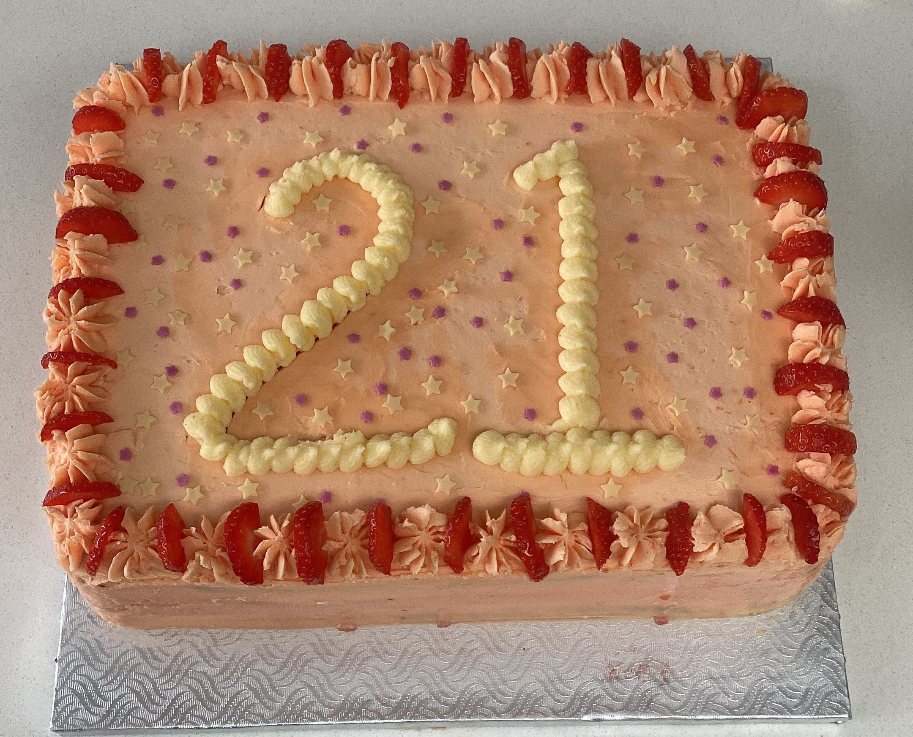
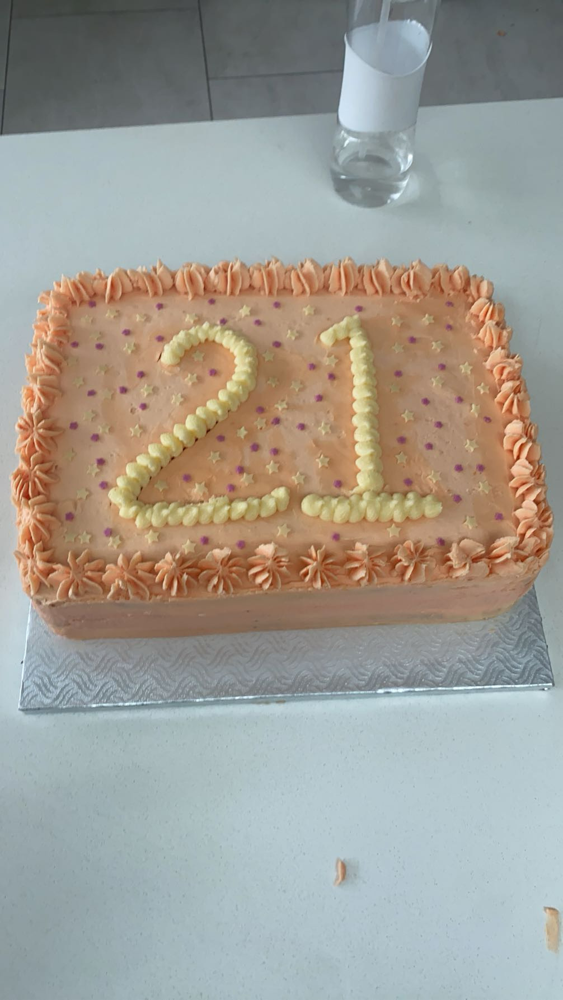
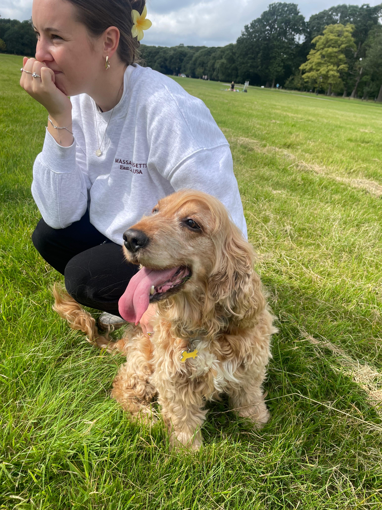
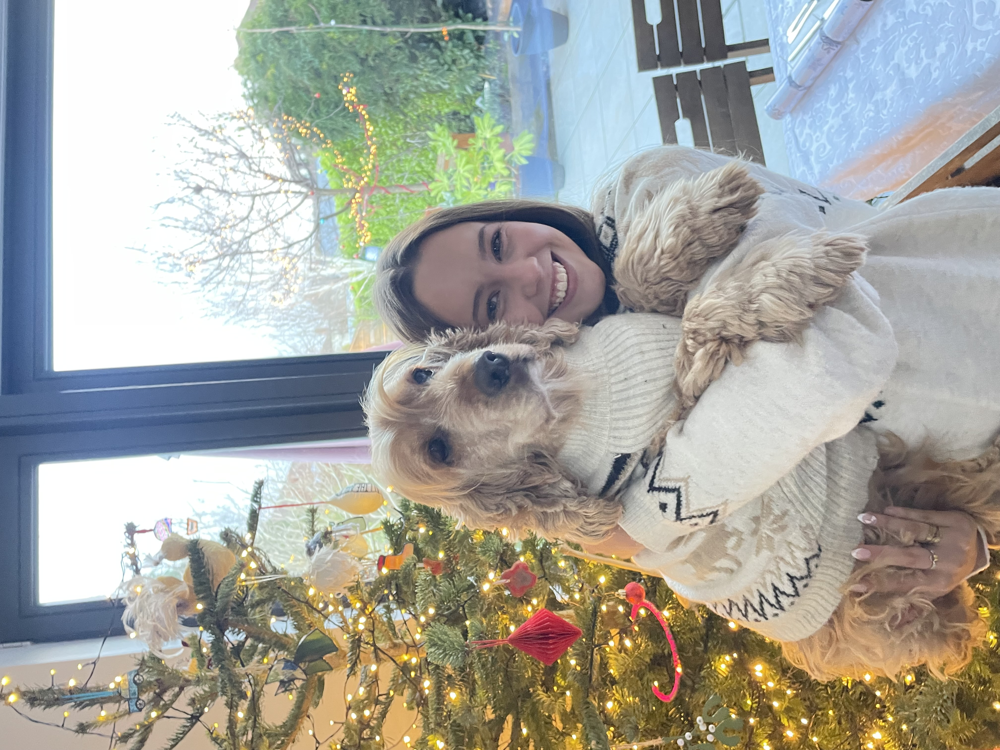
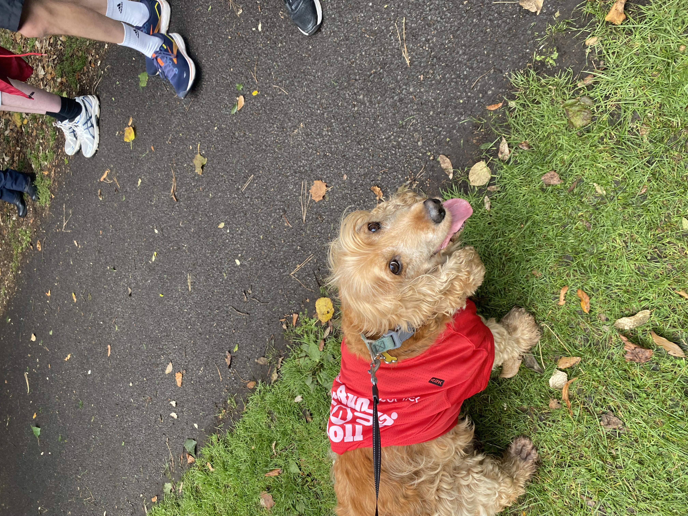
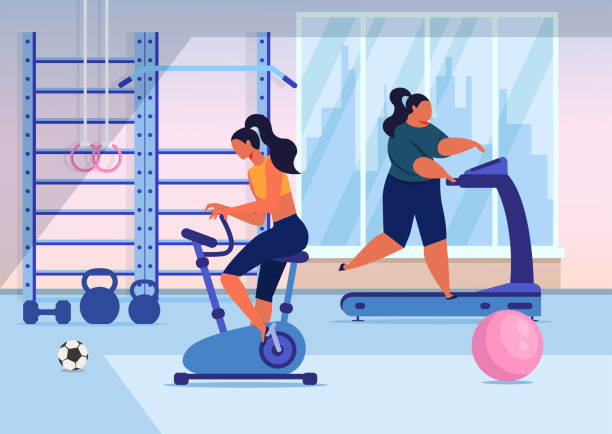

Alongside my academic studies and part-time work, I spend a lot of my time doing things that I love — whether that be walking my dog, going to the gym, or baking.

## 🎂 Baking

One of my favourite things to do is bake! Whenever I have free time, I bake for my friends and family. I've been commissioned to make birthday cakes for friends, and this is something I would love to do more of.

:::: {.columns}

::: {.column width="48%"}
::: {.card style="padding:20px; border-radius:10px; box-shadow:0 4px 10px rgba(0,0,0,0.15); margin-bottom:25px;"}
{style="width:100%; border-radius:6px;"}
:::
:::

::: {.column width="4%"}
:::

::: {.column width="48%"}
::: {.card style="padding:20px; border-radius:10px; box-shadow:0 4px 10px rgba(0,0,0,0.15); margin-bottom:25px;"}
{style="width:100%; border-radius:6px;"}
:::
:::

::::

::: {.card style="padding:20px; border-radius:10px; box-shadow:0 4px 10px rgba(0,0,0,0.15); margin-bottom:25px; max-width:700px; margin-left:auto; margin-right:auto;"}
<iframe width="100%" height="315" src="https://www.youtube.com/embed/Ib2wJcozWcM" frameborder="0" allowfullscreen style="border-radius:6px;"></iframe>
:::

## 🐕 Me and my dog

I spend every morning walking my dog, Rafa. It is the highlight of my day! At 12 years old, he still gets just as excited for his walks in the park as he did when he was a puppy!
```{=html}
<div style="position:relative; max-width:400px; margin:auto; border-radius:10px; overflow:hidden; box-shadow:0 4px 10px rgba(0,0,0,0.15);">
  <div id="dogCarousel" style="display:flex; transition:transform 0.4s ease;">
    
    
    
    
  </div>
  <button onclick="moveCarousel(-1)" style="position:absolute; top:50%; left:10px; transform:translateY(-50%); background:rgba(0,0,0,0.4); color:white; border:none; border-radius:50%; width:36px; height:36px; font-size:18px; cursor:pointer;">&#8249;</button>
  <button onclick="moveCarousel(1)" style="position:absolute; top:50%; right:10px; transform:translateY(-50%); background:rgba(0,0,0,0.4); color:white; border:none; border-radius:50%; width:36px; height:36px; font-size:18px; cursor:pointer;">&#8250;</button>
  <div style="position:absolute; bottom:10px; width:100%; text-align:center;">
    <span onclick="goToSlide(0)" class="dot" style="display:inline-block; width:10px; height:10px; background:white; border-radius:50%; margin:3px; cursor:pointer; opacity:0.6;"></span>
    <span onclick="goToSlide(1)" class="dot" style="display:inline-block; width:10px; height:10px; background:white; border-radius:50%; margin:3px; cursor:pointer; opacity:0.6;"></span>
    <span onclick="goToSlide(2)" class="dot" style="display:inline-block; width:10px; height:10px; background:white; border-radius:50%; margin:3px; cursor:pointer; opacity:0.6;"></span>
    <span onclick="goToSlide(3)" class="dot" style="display:inline-block; width:10px; height:10px; background:white; border-radius:50%; margin:3px; cursor:pointer; opacity:0.6;"></span>
  </div>
</div>
<script>
let dogCurrent = 0;
const dogTotal = 4;
function moveCarousel(dir) {
  dogCurrent = (dogCurrent + dir + dogTotal) % dogTotal;
  updateCarousel();
}
function goToSlide(index) {
  dogCurrent = index;
  updateCarousel();
}
function updateCarousel() {
  document.getElementById('dogCarousel').style.transform = 'translateX(-' + (dogCurrent * 100) + '%)';
  document.querySelectorAll('.dot').forEach(function(dot, i) {
    dot.style.opacity = i === dogCurrent ? '1' : '0.6';
  });
}
</script>
```

## 💪 Gym

I regularly spend time at the gym to support both my physical and emotional wellbeing. Exercising helps me step away from the pressures of work and study, allowing me to clear my mind, reduce stress, and focus on improving my fitness. I enjoy going both on my own and with friends—it provides a great balance of social interaction as well as personal time.

:::: {.columns}

::: {.column width="48%"}
::: {.card style="padding:20px; border-radius:10px; box-shadow:0 4px 10px rgba(0,0,0,0.15); margin-bottom:25px;"}
{style="width:100%; height:300px; object-fit:cover; border-radius:6px;"}
:::
:::

::: {.column width="4%"}
:::

::: {.column width="48%"}
::: {.card style="padding:20px; border-radius:10px; box-shadow:0 4px 10px rgba(0,0,0,0.15); margin-bottom:25px;"}
{style="width:100%; height:300px; object-fit:cover; border-radius:6px;"}
:::
:::

::::