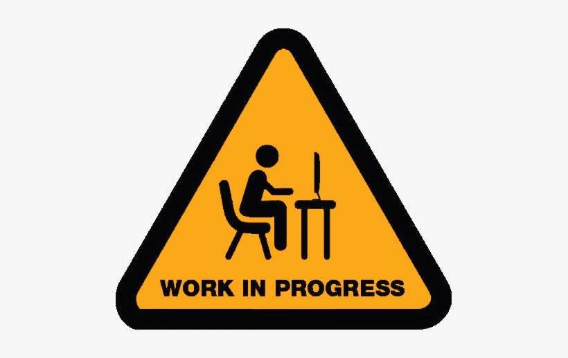

A collection of media, presentations, and achievements.

## Presentations & Slides

:::: {.columns}

::: {.column width="48%"}
::: {.card style="padding:20px; border-radius:10px; box-shadow:0 4px 10px rgba(0,0,0,0.15); margin-bottom:25px;"}
{style="width:100%; border-radius:6px; margin-bottom:10px;"}

**Presentation Title Here**

A brief description of the presentation — topic, context, and date.

[More →](Images/work_in_progress.jpg){.btn .btn-primary}
:::
:::

::: {.column width="4%"}
:::

::: {.column width="48%"}
::: {.card style="padding:20px; border-radius:10px; box-shadow:0 4px 10px rgba(0,0,0,0.15); margin-bottom:25px;"}
{style="width:100%; border-radius:6px; margin-bottom:10px;"}

**Presentation Title Here**

A brief description of the presentation — topic, context, and date.

[More →](Images/work_in_progress.jpg){.btn .btn-primary}
:::
:::

::::

## Videos

**Ad for Enterprise module**

In my enterprise module we were asked to create a new product or service that does not exist yet. My group's idea is a hamstring band which is worn on both legs and sends vibration signals when it detects a potential strain. Below is the ad for the product.

::: {.card style="padding:20px; border-radius:10px; box-shadow:0 4px 10px rgba(0,0,0,0.15); margin-bottom:25px; max-width:700px; margin-left:auto; margin-right:auto;"}
<iframe width="100%" height="400" src="https://www.youtube.com/embed/S-6mkB5iONY" frameborder="0" allowfullscreen style="border-radius:6px;"></iframe>
:::