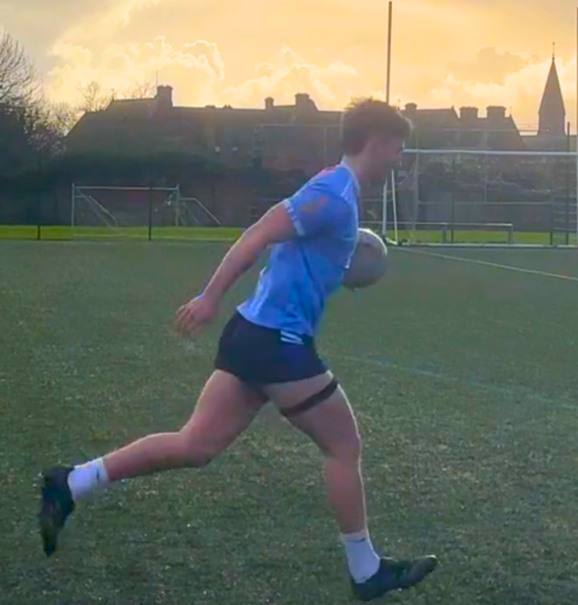

## Machine Learning

This section covers applied machine learning projects including statistical analysis, data visualisation, and predictive modelling.

::: {.card style="padding:15px; border-radius:10px; box-shadow:0 1.5px 6px var(--accent); text-align:center;"}
{style="width:100%; height:160px; object-fit:cover; border-radius:8px; margin-bottom:10px;"}

::: {style="font-size:0.8rem; color:#4A6080; margin: 6px 0;"}
👤 Cáit O'Reilly &nbsp;|&nbsp; 📅 April 2026
:::

::: {style="display:center; flex-wrap:wrap; gap:5px; margin-bottom:10px; text-align:center;"}
[Research]{.badge .bg-primary}
[Academic]{.badge .bg-secondary}
:::

[Predicting Depression →](projects_files/Predicting-Student-Depression-Using-Machine-Learning.pdf){.btn .btn-accent .btn-sm target="_blank"}
:::

::: {.card style="padding:15px; border-radius:10px; box-shadow:0 1.5px 6px var(--accent); text-align:center;"}
{style="width:100%; height:160px; object-fit:cover; border-radius:8px; margin-bottom:10px;"}

::: {style="font-size:0.8rem; color:#4A6080; margin: 6px 0;"}
👤 Cáit O'Reilly &nbsp;|&nbsp; 📅 Dec. 2025
:::

::: {style="display:center; flex-wrap:wrap; gap:5px; margin-bottom:10px; text-align:center;"}
[Code]{.badge .bg-primary}
[Academic]{.badge .bg-secondary}
:::

[Python Code →](python-chunks.qmd){.btn .btn-accent .btn-sm}
:::

::: {.card style="padding:15px; border-radius:10px; box-shadow:0 1.5px 6px var(--accent); text-align:center;"}
{style="width:100%; height:160px; object-fit:cover; border-radius:8px; margin-bottom:10px;"}

::: {style="font-size:0.8rem; color:#4A6080; margin: 6px 0;"}
👤 Cáit O'Reilly &nbsp;|&nbsp; 📅 Feb. 2026
:::

::: {style="display:center; flex-wrap:wrap; gap:5px; margin-bottom:10px; text-align:center;"}
[Reflection]{.badge .bg-primary}
[Academic]{.badge .bg-secondary}
:::

[Critical Reflection →](critical-reflection.qmd){.btn .btn-accent .btn-sm}
:::

## New Enterprise Development

This module focuses on the process of developing and assessing new business ventures, guiding us from initial idea generation through to market positioning and implementation. A key aspect of the module was creating our own original product concept. Our group developed VIVA, a wearable device designed to be placed on the hamstring. The device is intended to monitor muscle activity and detect early signs of potential strain, triggering vibrations to alert the user before an injury occurs.

👤 Group 15 &nbsp;|&nbsp; 📅 Oct. 2025

Concept Professional

<a href="projects_files/concept-paper.pdf" class="btn btn-accent btn-sm" target="_blank">Concept Paper →</a>

👤 Group 15 &nbsp;|&nbsp; 📅 Dec. 2025

Analysis Professional

<a href="projects_files/feasability-analysis.pdf" class="btn btn-accent btn-sm" target="_blank">Feasibility Report →</a>

👤 Group 15 &nbsp;|&nbsp; 📅 Feb. 2026

Report Professional

<a href="projects_files/marketing-strategy.pdf" class="btn btn-accent btn-sm" target="_blank">Marketing Report →</a>

👤 Group 15 &nbsp;|&nbsp; 📅 Feb. 2026

Video Professional

<a href="https://www.youtube.com/watch?v=nlmdZbdTcnE" class="btn btn-accent btn-sm" target="_blank">Marketing Video →</a>

👤 Group 15 &nbsp;|&nbsp; 📅 Mar. 2026

Pitch Professional

<a href="projects_files/dragons-den.pdf" class="btn btn-accent btn-sm" target="_blank">Pitch Deck →</a>

👤 Group 15 &nbsp;|&nbsp; 📅 Apr. 2026

Strategy Professional

<a href="projects_files/business-plan.pdf" class="btn btn-accent btn-sm" target="_blank">Business Plan →</a>

