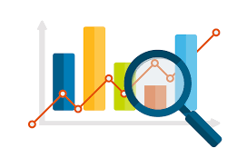

## Project 1 — Statistical Tests and Regression using Jamovi

::: {.card style="padding:20px; border-radius:10px; box-shadow:0 4px 10px rgba(0,0,0,0.15); margin-bottom:25px;"}
{style="width:100%; border-radius:6px; margin-bottom:10px;"}

[View Project →](project1.qmd){.btn .btn-primary}
:::

## Project 2 — Sales Dashboard Analysis using Power BI

::: {.card style="padding:20px; border-radius:10px; box-shadow:0 4px 10px rgba(0,0,0,0.15); margin-bottom:25px;"}
{style="width:100%; border-radius:6px; margin-bottom:10px;"}

[View Project →](project2.qmd){.btn .btn-primary}
:::

## Project 3 — Confidence Intervals and Sampling Distributions

::: {.card style="padding:20px; border-radius:10px; box-shadow:0 4px 10px rgba(0,0,0,0.15); margin-bottom:25px;"}
{style="width:100%; border-radius:6px; margin-bottom:10px;"}

[View Project →](project3.qmd){.btn .btn-primary}
:::