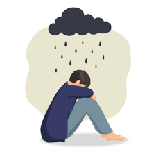
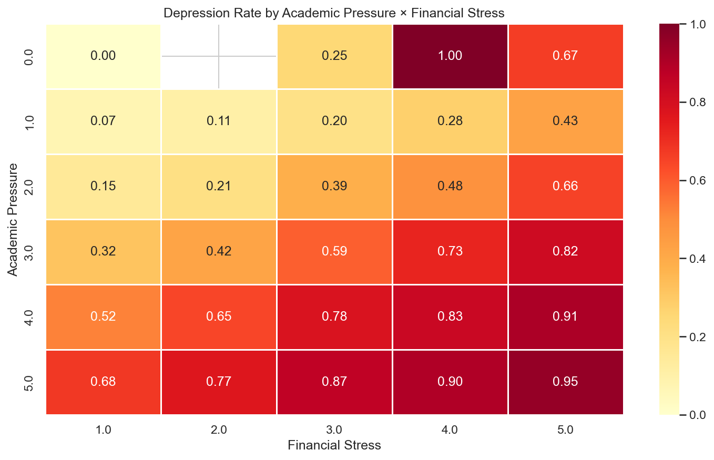
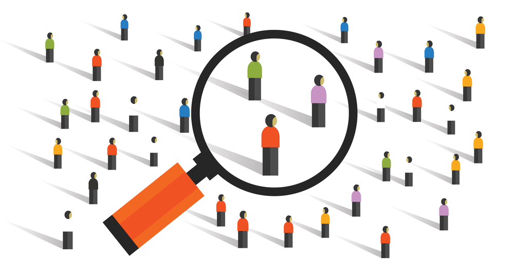
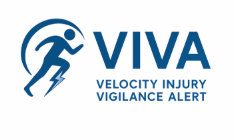
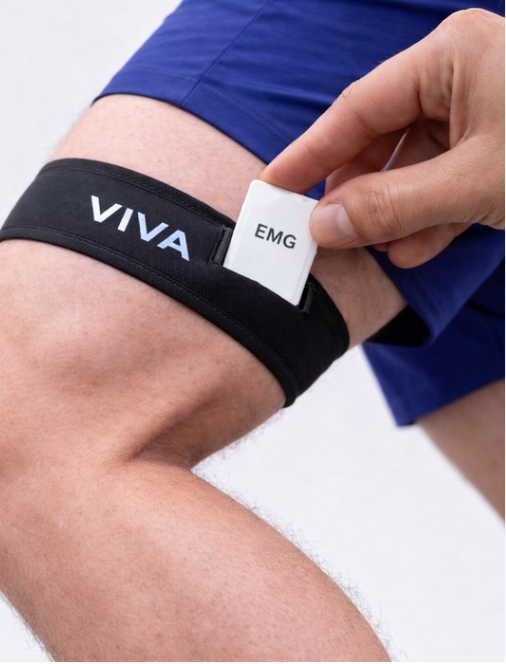
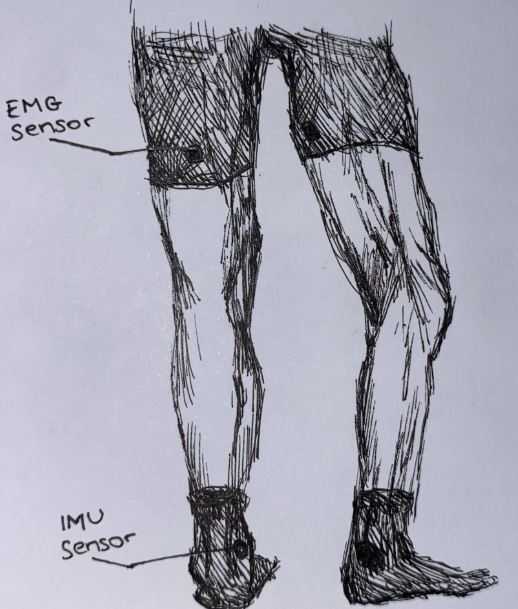
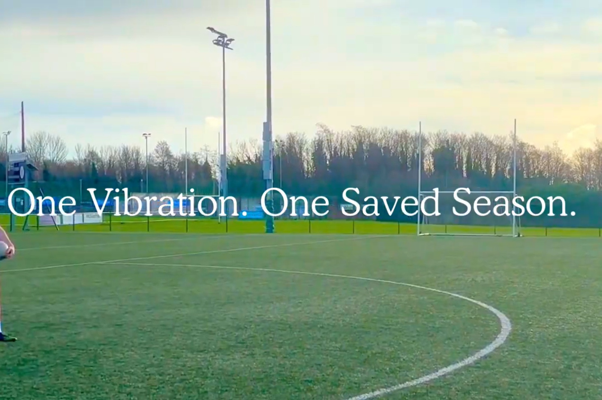
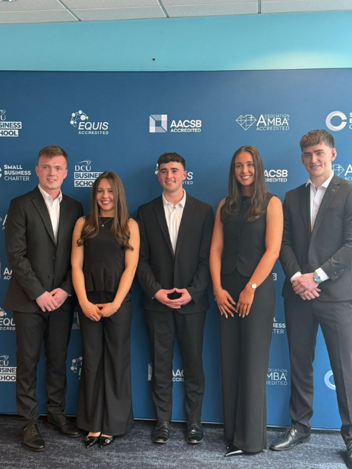
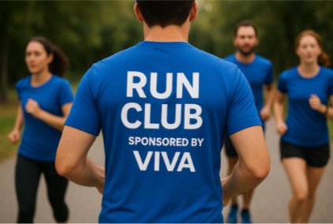

## Machine Learning

This section covers applied machine learning projects including statistical analysis, data visualisation, and predictive modelling.

::: {.card style="padding:15px; border-radius:10px; box-shadow:0 1.5px 6px var(--accent); text-align:center;"}
{style="width:100%; height:160px; object-fit:cover; border-radius:8px; margin-bottom:10px;"}

::: {style="font-size:0.8rem; color:#4A6080; margin: 6px 0;"}
👤 Cáit O'Reilly &nbsp;|&nbsp; 📅 Apr. 2026
:::

::: {style="display:center; flex-wrap:wrap; gap:5px; margin-bottom:10px; text-align:center;"}
[Research]{.badge .bg-primary}
[Academic]{.badge .bg-secondary}
:::

[Predicting Depression →](projects_files/Predicting-Student-Depression-Using-Machine-Learning.pdf){.btn .btn-accent .btn-sm target="_blank"}
:::

::: {.card style="padding:15px; border-radius:10px; box-shadow:0 1.5px 6px var(--accent); text-align:center;"}
{style="width:100%; height:160px; object-fit:cover; border-radius:8px; margin-bottom:10px;"}

::: {style="font-size:0.8rem; color:#4A6080; margin: 6px 0;"}
👤 Cáit O'Reilly &nbsp;|&nbsp; 📅 Dec. 2025
:::

::: {style="display:center; flex-wrap:wrap; gap:5px; margin-bottom:10px; text-align:center;"}
[Code]{.badge .bg-primary}
[Academic]{.badge .bg-secondary}
:::

[Python Code →](python-chunks.qmd){.btn .btn-accent .btn-sm}
:::

::: {.card style="padding:15px; border-radius:10px; box-shadow:0 1.5px 6px var(--accent); text-align:center;"}
{style="width:100%; height:160px; object-fit:cover; border-radius:8px; margin-bottom:10px;"}

::: {style="font-size:0.8rem; color:#4A6080; margin: 6px 0;"}
👤 Cáit O'Reilly &nbsp;|&nbsp; 📅 Feb. 2026
:::

::: {style="display:center; flex-wrap:wrap; gap:5px; margin-bottom:10px; text-align:center;"}
[Reflection]{.badge .bg-primary}
[Academic]{.badge .bg-secondary}
:::

[Critical Reflection →](critical-reflection.qmd){.btn .btn-accent .btn-sm}
:::

## New Enterprise Development

This module focuses on the process of developing and assessing new business ventures, guiding us from initial idea generation through to market positioning and implementation. A key aspect of the module was creating our own original product concept. Our group developed VIVA, a wearable device designed to be placed on the hamstring. The device is intended to monitor muscle activity and detect early signs of potential strain, triggering vibrations to alert the user before an injury occurs.

::: {.card .ned-card style="padding:15px; border-radius:10px; box-shadow:0 1.5px 6px var(--accent); text-align:center;"}

::: {style="font-size:0.8rem; color:#4A6080; margin: 6px 0;"}
👤 Group 15 &nbsp;|&nbsp; 📅 Oct. 2025
:::

::: {style="display:center; flex-wrap:wrap; gap:5px; margin-bottom:10px; text-align:center;"}
[Concept]{.badge .bg-primary}
[Professional]{.badge .bg-secondary}
:::

[Concept Paper →](projects_files/concept-paper.pdf){.btn .btn-accent .btn-sm target="_blank"}
:::

::: {.card .ned-card style="padding:15px; border-radius:10px; box-shadow:0 1.5px 6px var(--accent); text-align:center;"}

::: {style="font-size:0.8rem; color:#4A6080; margin: 6px 0;"}
👤 Group 15 &nbsp;|&nbsp; 📅 Dec. 2025
:::

::: {style="display:center; flex-wrap:wrap; gap:5px; margin-bottom:10px; text-align:center;"}
[Analysis]{.badge .bg-primary}
[Professional]{.badge .bg-secondary}
:::

[Feasibility Report →](projects_files/feasability-analysis.pdf){.btn .btn-accent .btn-sm target="_blank"}
:::

::: {.card .ned-card style="padding:15px; border-radius:10px; box-shadow:0 1.5px 6px var(--accent); text-align:center;"}

::: {style="font-size:0.8rem; color:#4A6080; margin: 6px 0;"}
👤 Group 15 &nbsp;|&nbsp; 📅 Feb. 2026
:::

::: {style="display:center; flex-wrap:wrap; gap:5px; margin-bottom:10px; text-align:center;"}
[Report]{.badge .bg-primary}
[Professional]{.badge .bg-secondary}
:::

[Marketing Report →](projects_files/marketing-strategy.pdf){.btn .btn-accent .btn-sm target="_blank"}
:::

::: {.card .ned-card style="padding:15px; border-radius:10px; box-shadow:0 1.5px 6px var(--accent); text-align:center;"}

::: {style="font-size:0.8rem; color:#4A6080; margin: 6px 0;"}
👤 Group 15 &nbsp;|&nbsp; 📅 Feb. 2026
:::

::: {style="display:center; flex-wrap:wrap; gap:5px; margin-bottom:10px; text-align:center;"}
[Video]{.badge .bg-primary}
[Professional]{.badge .bg-secondary}
:::

[Marketing Video →](video-project.qmd){.btn .btn-accent .btn-sm}
:::

::: {.card .ned-card style="padding:15px; border-radius:10px; box-shadow:0 1.5px 6px var(--accent); text-align:center;"}

::: {style="font-size:0.8rem; color:#4A6080; margin: 6px 0;"}
👤 Group 15 &nbsp;|&nbsp; 📅 Mar. 2026
:::

::: {style="display:center; flex-wrap:wrap; gap:5px; margin-bottom:10px; text-align:center;"}
[Pitch]{.badge .bg-primary}
[Professional]{.badge .bg-secondary}
:::

[Pitch Deck →](projects_files/dragons-den.pdf){.btn .btn-accent .btn-sm target="_blank"}
:::

::: {.card .ned-card style="padding:15px; border-radius:10px; box-shadow:0 1.5px 6px var(--accent); text-align:center;"}

::: {style="font-size:0.8rem; color:#4A6080; margin: 6px 0;"}
👤 Group 15 &nbsp;|&nbsp; 📅 Apr. 2026
:::

::: {style="display:center; flex-wrap:wrap; gap:5px; margin-bottom:10px; text-align:center;"}
[Strategy]{.badge .bg-primary}
[Professional]{.badge .bg-secondary}
:::

[Business Plan →](projects_files/business-plan.pdf){.btn .btn-accent .btn-sm target="_blank"}
:::

